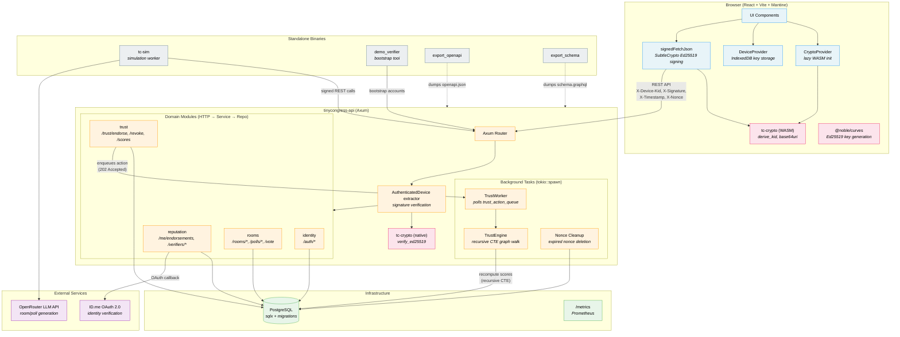
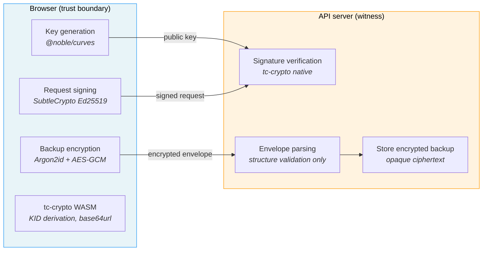
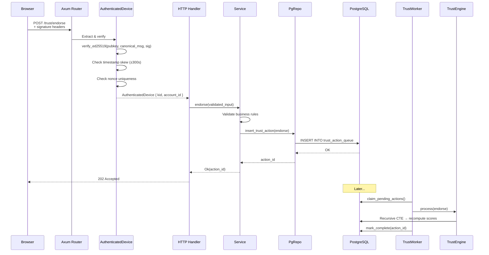

# Architecture Overview

A visual guide to TinyCongress's major components and data flow. For entity
details and invariants, see [domain-model.md](domain-model.md). For the
three-layer backend pattern, see
[ADR-016](decisions/016-repo-service-http-architecture.md).

## System Diagram

## Crypto Boundary

The server is a **witness**, not an authority. Private key material never
leaves the browser.

## Request Flow

A typical authenticated request through the three-layer backend:

